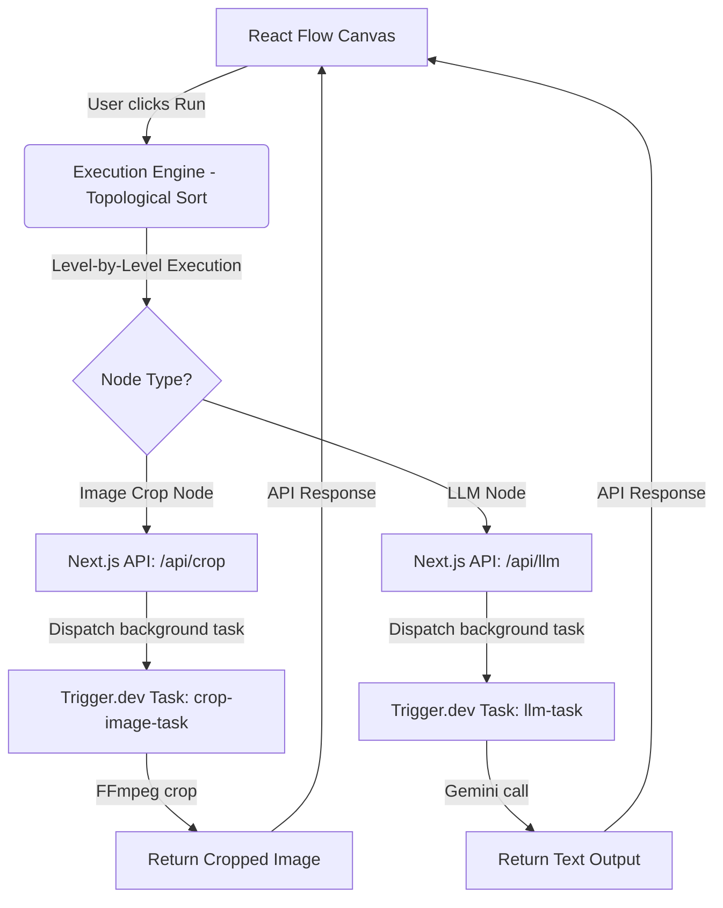

# 🌌 Quantum-Flow — AI-Powered Visual Workflow Builder

Quantum-Flow is a premium, visual, node-based workflow builder inspired by platforms like Krea.ai. It enables users to dynamically connect AI operations, image transformation nodes, and data blocks on an interactive canvas, executing them in a resilient Directed Acyclic Graph (DAG) pattern.

---

## 🎨 Key Features

- **Interactive Workflow Canvas**: Node-based editor built on **React Flow** featuring drag-and-drop support, custom node handles, and animated connection lines.
- **DAG Execution Engine**: Level-based, topological sorting execution that handles complex flows, processes levels concurrently, and prevents cycles using a robust cycle detection algorithm.
- **AI & Multimodal Integration**: Features a Multimodal LLM node that can accept combined text and image inputs to leverage AI generation.
- **Heavy Image Transformations**: An FFmpeg-powered image crop node for media transformations, executing reliably in isolated background workers.
- **Resilient Background Tasks**: Built-in support for **Trigger.dev (v3)** to defer long-running processes (FFmpeg cropping, LLM execution) to background queues, keeping the Next.js API responsive.
- **Execution History & Observability**: Real-time visual status reporting on nodes (running, success, error) with a comprehensive side panel history showing previous run parameters and outcomes.
- **Secure Authentication**: Clerk-managed authentication safeguarding private routes and workflows.

---

## 🛠️ Tech Stack & Libraries

- **Framework**: [Next.js](https://nextjs.org/) (App Router layout)
- **Language**: [TypeScript](https://www.typescriptlang.org/)
- **Visual Nodes Canvas**: [React Flow](https://reactflow.dev/)
- **State Management**: [Zustand](https://zustand-demo.pmnd.rs/)
- **Background Tasks Engine**: [Trigger.dev v3](https://trigger.dev/)
- **Authentication**: [Clerk Auth](https://clerk.com/)
- **Media Processing**: [fluent-ffmpeg](https://github.com/fluent-ffmpeg/node-fluent-ffmpeg) / [FFmpeg](https://ffmpeg.org/)
- **AI SDK**: [Google Gen AI SDK](https://github.com/googleapis/google-genai-nodejs) (Gemini)
- **Styling**: Vanilla CSS & Tailwind CSS

---

## 📂 Project Directory Structure

Following standard React and Next.js practices, the project is structured clean, isolating core application code in the `src/` folder:

```text
flow/
├── public/                 # Static assets (icons, SVGs, etc.)
├── src/                    # Main application code
│   ├── app/                # Next.js App Router (pages and API routes)
│   │   ├── api/            # API Endpoints (llm, crop, workflows, etc.)
│   │   ├── globals.css     # Global styles
│   │   ├── layout.tsx      # Main application layout
│   │   ├── page.tsx        # Homepage (authenticated client gateway)
│   │   └── middleware.ts   # Clerk Auth Middleware
│   ├── components/         # React Components
│   │   ├── canvas/         # React Flow Workflow Canvas
│   │   ├── nodes/          # Custom Node Components (LLM, Crop, Image, Text)
│   │   ├── sidebar/        # UI sidebars (Left: nodes; Right: run logs)
│   │   └── ClientWrapper.ts# Root client wrapper context
│   ├── lib/                # Shared utilities & configurations
│   └── store/              # Zustand global state (useWorkflowStore)
├── trigger/                # Trigger.dev background task workers
│   ├── crop.ts             # FFmpeg background image processing task
│   └── llm.ts              # Gemini background multimodal generation task
├── eslint.config.mjs       # Eslint configuration
├── next.config.ts          # Next.js configuration
├── package.json            # Project dependencies and scripts
├── trigger.config.ts       # Trigger.dev integration configuration
└── tsconfig.json           # TypeScript configuration
```

---

## ⚙️ System Architecture

Quantum-Flow is built with a decoupled architecture where the UI communicates with Next.js API Routes, which in turn delegate intensive or long-running computations to Trigger.dev tasks.



---

## 🚀 Setup & Installation

### Prerequisites
- Node.js (v18+)
- NPM or PNPM
- Clerk Account (for auth)
- Trigger.dev Account (for background queues)
- Gemini API Key (for LLM nodes)

### 1. Clone the repository
```bash
git clone https://github.com/sanskartripathi0912/Quantum-Flow.git
cd Quantum-Flow
```

### 2. Install dependencies
```bash
npm install
```

### 3. Setup Environment Variables
Create a `.env.local` file in the root directory and add the following keys:
```env
# Clerk Authentication Configuration
NEXT_PUBLIC_CLERK_PUBLISHABLE_KEY=pk_test_...
CLERK_SECRET_KEY=sk_test_...
NEXT_PUBLIC_CLERK_SIGN_IN_URL=/sign-in
NEXT_PUBLIC_CLERK_SIGN_UP_URL=/sign-up

# Trigger.dev Credentials
TRIGGER_SECRET_KEY=tr_dev_...

# Google Gemini Credentials
GEMINI_API_KEY=AIzaSy...
```

### 4. Initialize Trigger.dev Dev Server
To start the background worker process for task polling locally, run:
```bash
npx trigger.dev@latest dev
```

### 5. Run the Local Development Web Server
Start the local Next.js environment:
```bash
npm run dev
```
Open [http://localhost:3000](http://localhost:3000) in your browser to view Quantum-Flow in action!

---

## 💡 How to Use the Interface

1. **Add Nodes**: Drag nodes (Text, Image, LLM, Crop) from the **Left Sidebar** onto the canvas.
2. **Connect Inputs/Outputs**:
   - Connect the output of a **Text Node** or **Image Node** to the inputs of an **LLM Node** or **Crop Node**.
3. **Execute**: Click the **Run** button at the top header.
4. **Observe Progress**: Watch the green, yellow, and red status indicators change on individual nodes in real-time as tasks execute topological level by level.
5. **Inspect History**: View historical logs and outputs in the **Right Sidebar**'s History list.
